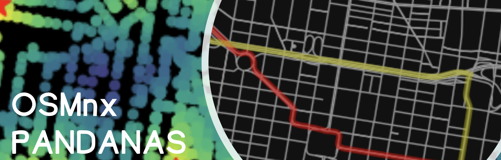

October 10

## Reference & Additional Readings

- OSMnx
  - [GitHub](https://github.com/gboeing/osmnx)
  - [Introductory Blog Post](https://geoffboeing.com/2016/11/osmnx-python-street-networks/)
  - [Jupyter Notebook Examples](https://github.com/gboeing/osmnx-examples/tree/master/notebooks)
  - [Documentation](https://osmnx.readthedocs.io)
  - [Street orientation example](https://geoffboeing.com/2019/09/urban-street-network-orientation/)
- Pandana
  - [GitHub](https://github.com/UDST/pandana)
  - [Jupyter Notebook Examples](https://github.com/UDST/pandana/tree/master/examples)
  - [Documentation](http://udst.github.io/pandana/)
- OpenStreetMap
  - [OSM Wikipedia](https://wiki.openstreetmap.org/wiki)
  - [List of OSM feature types](https://wiki.openstreetmap.org/wiki/Map_Features)
  - [List of OSM amenities](https://wiki.openstreetmap.org/wiki/Key:amenity)
- [Bounding box tool](http://boundingbox.klokantech.com/)

